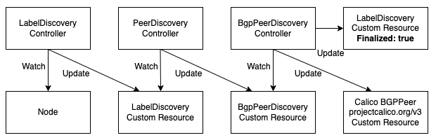

# cni-nanny

[](https://github.com/sapcc/cni-nanny/actions/workflows/ci.yaml)
[](https://goreportcard.com/report/github.com/sapcc/cni-nanny)

Helper for CNI operations. Set of controllers help to discover and configure Calico BGP peers.  

[]

Why?
----

Each rack TORs have different IP addresses for peering with Calico nodes. Peer discovery is based on traceroute. 

Rediscover BGP Peers
----

In case Calico `BGPPeers` need to be recreated (e.g. `BGPFilters` or AS number change), following can be done to trigger rediscovery.

1. Optional. Given each rack has two BGP peers, remove the half of BGP peers at one time to avoid downtime.
```shell
# print every first line
› kubectl get bgppeer | awk '{print $1}' | grep -v NAME | awk 'NR % 2 == 1'

# print every second line
› kubectl get bgppeer | awk '{print $1}' | grep -v NAME | awk 'NR % 2 == 0'
```

2. Delete Calico `BGPPeer` resources
```shell
› kubectl delete bgppeer bgp-peer-pod123-10.10.11.10
```

3. Delete `BgpPeerDiscovery` resources.
```shell
› kubectl delete bgppeerdiscovery -l app.kubernetes.io/managed-by=cni-nanny
```

4. Delete `LabelDiscovery` resources.
```shell
› kubectl delete labeldiscovery -l app.kubernetes.io/managed-by=cni-nanny
```

5. Wait for the new discovery to complete.
